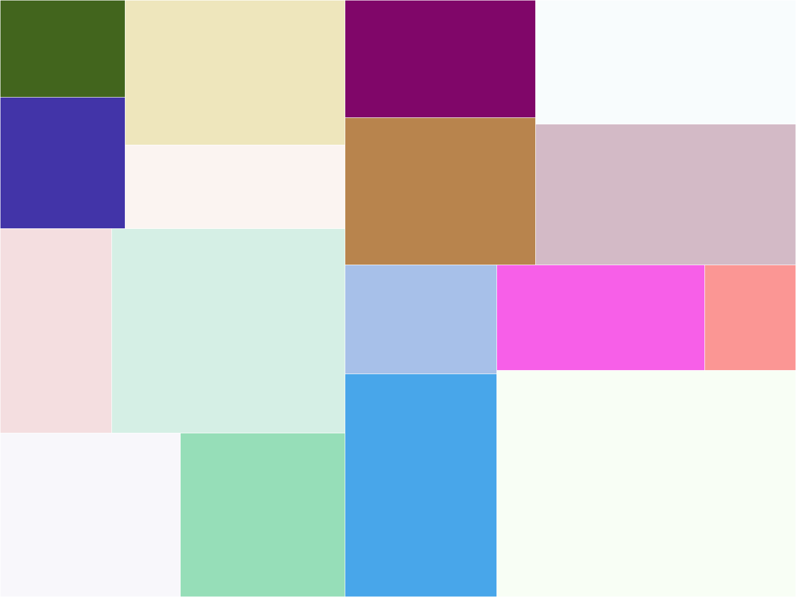

# TileSaver
by **Jens Kilian**, copyright © 1997–2000

TileSaver is a colorful screensaver that draws rectangles all over the screen.

### How to install
Run `make` in the source directory
and copy the binary file into /boot/system/home/config/non-packaged/add-ons/Screen Savers`.
